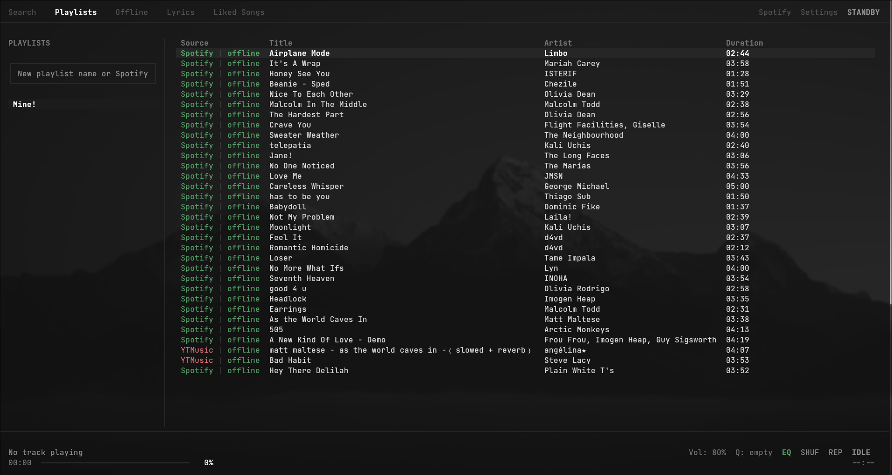
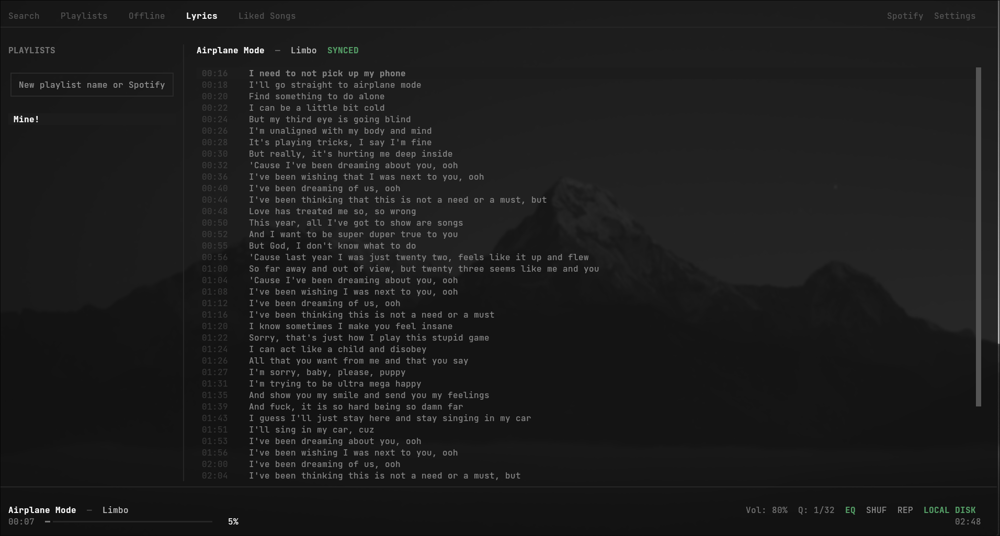

# spoff

Terminal audio player for Linux that streams from YouTube Music and syncs Spotify metadata with local caching, synchronized LRC lyrics, and a CAVA spectrum visualizer.





## Architecture

- Playback: streams audio via YouTube Music through a background `mpv` process over a local Unix domain socket. Played tracks save automatically to `~/.local/share/spoff/cache/` for offline playback without requiring Spotify Premium.
- Spectrum visualizer: connects to a `cava` FIFO pipe to read raw PCM audio data and renders spectrum bars at 60 FPS in the terminal.
- Search and library: queries YouTube Music for audio streams and syncs with Spotify user libraries (`Ctrl+E` toggles between search backends).
- Synced lyrics: parses LRC timestamps with click-to-seek and keyboard navigation.
- MPRIS 2 interface: registers on D-Bus for integration with `playerctl`, Waybar, lockscreens, and hardware media keys.
- Interface: built with Textual, with full vim keybindings (`h`/`j`/`k`/`l`).

## Installation

### Dependencies

- Python 3.10+
- `mpv` (playback engine)
- `cava` (visualizer, optional)

On Arch Linux:
```bash
sudo pacman -S mpv cava python
```

On Debian / Ubuntu:
```bash
sudo apt install mpv cava python3 python3-pip
```

On Fedora:
```bash
sudo dnf install mpv cava python3
```

### Install with pipx

```bash
pipx install git+https://github.com/vrdq/spoff.git
```

To update:
```bash
pipx upgrade spoff
```

### Arch Linux (AUR)

```bash
yay -S spoff
```

Or build with makepkg:
```bash
git clone https://github.com/vrdq/spoff.git
cd spoff
makepkg -si
```

### Build from Source

```bash
git clone https://github.com/vrdq/spoff.git
cd spoff
python3 -m venv .venv
source .venv/bin/activate
pip install -e .
spoff
```

## Workflows

### Search and Play
Press `1` to open Search and begin typing. Press `Enter` to play the highlighted track, or `a` to save it to a playlist. Switch between YouTube Music and Spotify search engines with `Ctrl+E`.

### Import Links
Paste any Spotify URL (`https://open.spotify.com/playlist/...`, album, or track) or YouTube Music URL directly into the sidebar input (`i`). Spoff parses and loads the tracklist immediately.

### Browse Playlists
Press `2` to focus the playlist sidebar. Use `j` and `k` to scroll through playlists. Press `Enter` or `l` to jump into the tracklist, select a song, and press `Enter` to play. Press `h` to return to the sidebar.

### Synced Lyrics
Press `4` while playing a track to open live lyrics. Use `j`/`k` or mouse click, and press `Enter` on any line to seek playback to that timestamp.

### Reorder Tracks
In playlist view, press `Shift+J` or `Shift+K` to move a song down or up. In the sidebar, `Shift+J` and `Shift+K` reorder playlists.

## Keybindings

### Navigation
| Key | Action |
| --- | --- |
| `1` | Search view |
| `2` | Playlists view (focus sidebar) |
| `3` | Offline cached library |
| `4` | Synced lyrics view |
| `h` / `Left` | Focus playlists sidebar |
| `l` / `Right` | Focus tracks table |
| `j` / `Down` | Move cursor down |
| `k` / `Up` | Move cursor up |
| `Tab` | Cycle focus between sidebar and main view |
| `Escape` | Dismiss modal / unfocus input / return to table |

### Playback
| Key | Action |
| --- | --- |
| `Enter` | Play highlighted track |
| `Space` | Toggle Play / Pause |
| `p` | Previous track in queue |
| `n` | Next track in queue |
| `Left` / `Right` | Seek backward / forward 5 seconds |
| `b` | Focus scrub bar (`h`/`l` for 5s, `0`-`9` for 0%-90%) |
| `s` | Toggle Shuffle |
| `r` | Toggle Repeat mode |
| `c` | Copy track link to clipboard |
| `F2` / `Down` | Lower volume (-5%) |
| `F3` / `Up` | Raise volume (+5%) |
| `F1` | Mute / Unmute |

### Library Management
| Key | Action |
| --- | --- |
| `a` | Add highlighted track to playlist |
| `y` | Copy playlist link to clipboard |
| `i` | Focus playlist import input |
| `Shift+J` / `Shift+Down` | Move track or playlist down |
| `Shift+K` / `Shift+Up` | Move track or playlist up |
| `d` / `Delete` | Remove song from playlist |
| `Shift+D` | Delete playlist |

### System
| Key | Action |
| --- | --- |
| `Ctrl+E` | Switch search engine (YouTube Music / Spotify) |
| `,` | Open Settings |
| `L` | Connect / Sync Spotify account |
| `:` | Open Keybindings modal |
| `u` | Check for updates |
| `q` | Quit |

## File Locations

Configuration and cached audio follow XDG paths:

- Cached audio: `~/.local/share/spoff/cache/`
- Playlists and metadata: `~/.local/share/spoff/playlists.json`
- User settings: `~/.config/spoff/settings.json`
- Spotify auth tokens: `~/.config/spoff/spotify_auth.json`

## License

MIT
