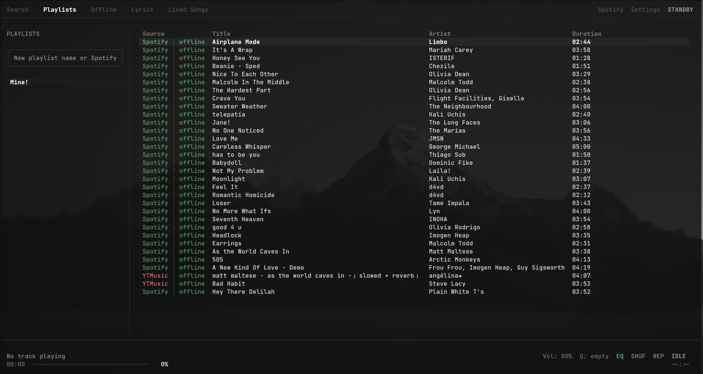
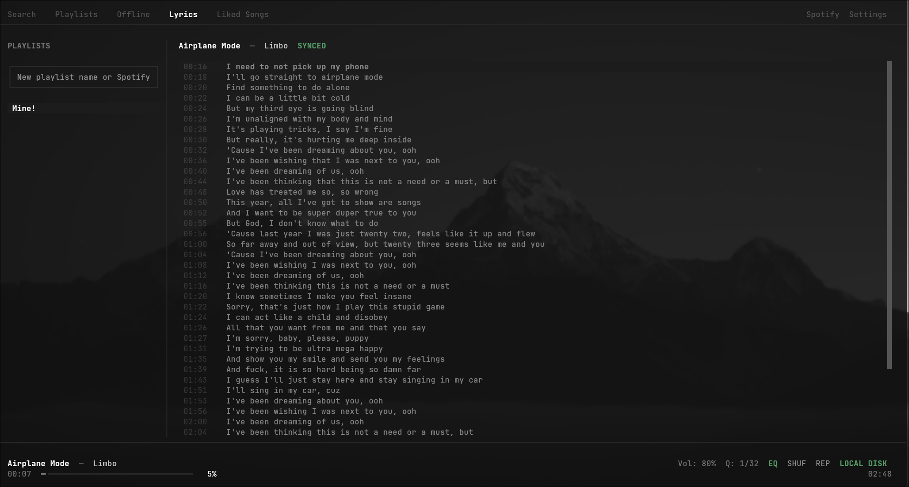

<p align="center">
  
</p>

# spoff

[](https://pypi.org/project/spoff/)
[](https://awesometui.com/spoff)
[](https://discord.gg/9xHrMRTwwZ)
[](LICENSE)
[](https://www.python.org/downloads/)

A terminal music player for Linux. It plays audio from YouTube Music, keeps your Spotify playlists in sync, saves songs for offline listening, and shows synced lyrics and a spectrum visualizer.





## What it does

- Plays YouTube Music audio through mpv. spoff saves every song you play, so it works offline afterwards, and you don't need Spotify Premium.
- Gets 256 kbps audio if you have YouTube Music Premium. Sign in with Google from Settings and spoff uses your browser's login without copying or storing it. It also re-downloads songs you saved earlier at lower quality, this time at 256 kbps.
- Syncs your Spotify playlists and liked songs both ways. Songs you add from YouTube Music stay in spoff and never go to Spotify, and playlists you delete on Spotify stay deleted.
- Can copy your playlists to YouTube Music (off by default). Songs you add or remove in spoff follow, and spoff leaves alone anything you add in the YouTube Music app.
- Makes slowed + reverb, sped up, nightcore, bass boosted and 8D versions of songs. Press `m` on a downloaded song. Each preset plays live as you move to it, sliders adjust speed, reverb, bass and 8D, and saved mods get their own Modded tab.
- Has a parametric EQ with presets (Harman, diffuse field, Moondrop Chu II and more) and AutoEQ / EqualizerAPO import from the clipboard, plus optional loudness levelling.
- Shows synced lyrics from LRCLIB. Click or press Enter on any line to jump there.
- Draws a visualizer through cava, in several styles and colours.
- Supports MPRIS 2, so media keys, `playerctl`, Waybar and lockscreens can control it.
- Uses vim keys everywhere, and you can rebind every key in Settings.

## Install

You need `mpv` and `ffmpeg`. `cava` is optional (visualizer), and so is `nodejs`, `deno` or `bun`, which you only need for 256 kbps audio when signed in to YouTube Music Premium.

```bash
sudo pacman -S mpv ffmpeg cava nodejs          # Arch
sudo apt install mpv ffmpeg cava nodejs        # Debian / Ubuntu
sudo dnf install mpv ffmpeg cava nodejs        # Fedora
```

### pipx

```bash
pipx install spoff
```

spoff tells you when a new release is out; `pipx upgrade spoff` updates it.

### AppImage

Download `spoff-x86_64.AppImage` from the [releases page](https://github.com/vrdq/spoff/releases), make it executable and run it. It bundles Python and all of spoff's Python packages, but not mpv or ffmpeg. The first release with an AppImage will be the one after v0.1.0.

### Flatpak

Not on Flathub yet. The manifest in [`packaging/flatpak`](packaging/flatpak) builds a Flatpak that includes mpv, ffmpeg, cava and deno; see its README for the commands.

### Arch (makepkg)

spoff isn't on the AUR yet. The PKGBUILD in this repo builds the latest PyPI release as a pacman package:

```bash
git clone https://github.com/vrdq/spoff.git
cd spoff
makepkg -si
```

Pacman owns this install, so update by pulling and running `makepkg -si` again. spoff won't try to update itself.

### From source

```bash
git clone https://github.com/vrdq/spoff.git
cd spoff
python3 -m venv .venv
source .venv/bin/activate      # fish: source .venv/bin/activate.fish
pip install -e .
spoff
```

## Getting started

- Press `1` and type to search. `Enter` plays the highlighted song, `a` adds it to a playlist and `l` likes it. `Ctrl+E` switches between YouTube Music and Spotify search.
- Paste a Spotify or YouTube Music playlist, album or track link into the sidebar box (`i`) to import it.
- Press `2` for your playlists, move with `j`/`k`, and press `Enter` or `l` to open one. `h` goes back to the sidebar. `Shift+J`/`Shift+K` reorder songs or playlists, and `S` on a playlist edits its name, description and privacy.
- `b` downloads the highlighted song and `B` the whole playlist. Press `3` to see everything saved.
- Press `4` for lyrics while a song plays.
- Press `L` to connect your Spotify account.
- Press `,` for settings, the equalizer, YouTube sign-in and key bindings.

## Keys

Every key can be changed in Settings (`,`). These are the defaults.

### Navigation

| Key | Action |
| --- | --- |
| `1` `2` `3` `4` `5` `6` | Search, Playlists, Offline, Lyrics, Liked Songs, Modded |
| `h` | Focus the playlist sidebar |
| `Right` | Focus the song list |
| `j` / `k` (or arrows) | Move down / up |
| `Tab` | Switch between sidebar and song list |
| `f` | Find a song in the current view |
| `/` | Focus the search box |
| `Esc` | Close a popup or leave a text box |

### Playback

| Key | Action |
| --- | --- |
| `Enter` | Play the highlighted song |
| `Space` | Play / pause |
| `n` / `p` | Next / previous song |
| `Left` / `Right` | Seek 5 seconds back / forward |
| `s` | Shuffle |
| `r` | Cycle repeat mode |
| `Ctrl+R` | Song radio (similar songs) |
| `m` | Mod the highlighted song |
| `c` | Copy the song's link |
| `F1` / `F2` / `F3` | Mute / volume down / volume up |

### Library

| Key | Action |
| --- | --- |
| `a` | Add the song to a playlist |
| `l` | Like / unlike |
| `b` / `B` | Download the song / the whole playlist |
| `i` | New playlist or import a link |
| `d` | Remove the song (or delete a modded song) |
| `D` | Delete the playlist |
| `R` / `Y` / `S` | Rename / copy / playlist settings |
| `y` | Copy the playlist's link |
| `Shift+J` / `Shift+K` | Move the song or playlist down / up |

### Sound and visuals

| Key | Action |
| --- | --- |
| `e` | Equalizer |
| `E` | Bypass the EQ (A/B compare) |
| `Alt+E` | EQ settings |
| `v` / `Shift+V` / `C` | Visualizer style / on-off / colour |

### Other

| Key | Action |
| --- | --- |
| `Ctrl+E` | Switch search between YouTube Music and Spotify |
| `L` | Spotify account |
| `,` | Settings |
| `:` | Help |
| `u` | Check for updates |
| `q` | Quit |

## Files

Everything lives in `~/.local/share/spoff/`:

- `cache/` holds downloaded songs and saved mods
- `playlists.json`, `liked_songs.json` and `modded_tracks.json` hold your library
- `config.json` holds settings, including the EQ
- `spotify_auth.json` holds your Spotify login

Your Google login stays in your browser. spoff reads it when it needs it and never writes it to disk.

## Community

Questions, bug reports and EQ presets go on the [Discord server](https://discord.gg/9xHrMRTwwZ). Bugs can also go in [GitHub issues](https://github.com/vrdq/spoff/issues).

## License

MIT
